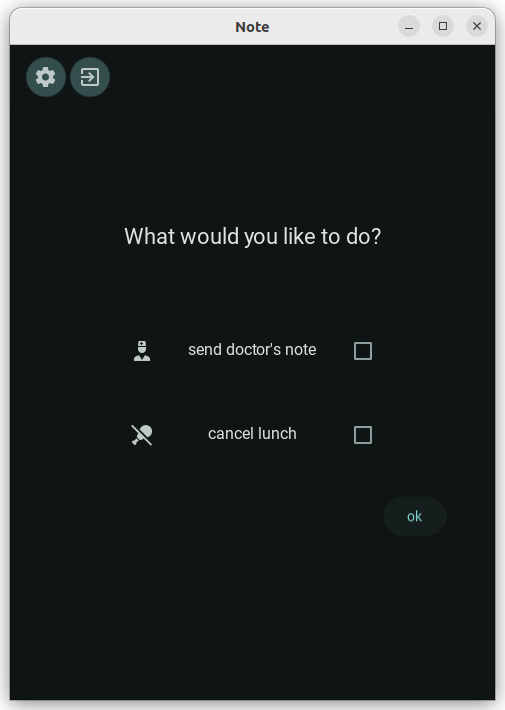

# EasyDoctorsnote
An App that eases the process of sending a doctor's note to school. Uses smtp username/password. Not yet implemented: Oauth.

This project is built on the kivy framework using an MVVM pattern and uses buildozer for packaging an apk file. 

Project Title:
EasyDoctorsnote

Description:
When your child is sick, it's important to notify the school about their 
absence, and you may also need to cancel lunch for those days. This app
simplifies the process by allowing you to select a specific date or 
date range and automatically send the necessary emails. To use the app,
you'll need to configure it with an SMTP server and a password. 
It does not access any information on your phone.

Table of Contents
About
This app is written in Python using Kivy.
Features
Installation

Usage
Contributing
License

