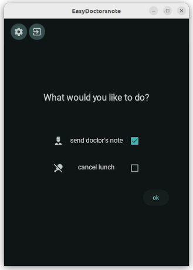
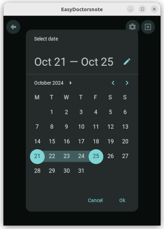
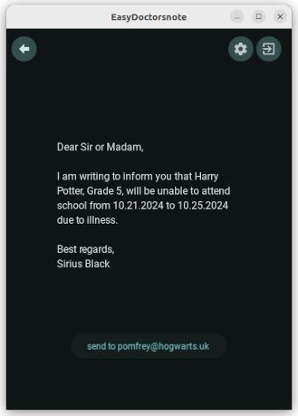

# EasyDoctorsnote
An App that eases the process of sending a doctor's note to school. Uses smtp username/password. Not yet implemented: Oauth.

This project is built on the kivy framework using an MVVM pattern and uses buildozer for packaging an apk file. 

Project Title:
EasyDoctorsnote

Description:
When your child is sick, it's important to notify the school about their 
absence, and you may also need to cancel lunch for those days. This app
simplifies the process by allowing you to select a specific date or 
date range and automatically send the necessary emails. To use the app,
you'll need to configure it with an SMTP server and a password. 
It does not access any information on your phone.
This app uses conda

Download:
If you just want to download the apk file to your android phone:
todo
Installation:
1) create the conda environment from the environment.yml to make sure you have all required packages:
   conda env create -f environment.yml
2) activate the newly created environment called doctorsnote_env:
   conda activate doctorsnote_env
3) if you want to test the program on your computer you can do:
   python main.py
4) to build the app for an android phone - an apk file:
   buildozer -v android debug
   This will create the apk file in the bin directory
5) If you have adb on your phone installed and the phone is connected to your computer you can now run:
   adb install bin/*.apk
6) For debugging the app you can do:
   adb logcat | grep python
   
Table of Contents
About
This app is written in Python using Kivy.
Features
Installation

Usage
Contributing
License

